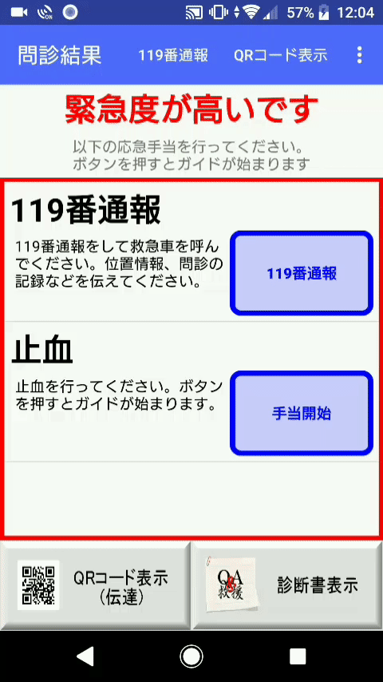

# RescuAidAndroid

スマートフォン（Android端末）を用いた救急救命支援システム

## Description

近く人が急に倒れた、怪我をしたような緊急時に迅速かつ的確な判断を下すのは難しい。このアプリケーションは緊急時の状況判断、対応、連絡をサポートするためのシステムである。アプリケーションを立ち上げた後は、テキストと音声に従ってボタンをタップするだけである。

***DEMO:***

アプリを立ち上げ、指示に従って回答する（音声が流れる）

応急手当てのやり方の説明（音声が流れる。ページは自動でも切り替わる）

## Features

- 医療に対する予備知識ゼロの人でもできる簡単な説明、手当に厳選
- 119番通報の緊急連絡をサポート

## Requirements

- compileSdkVersion 24
- buildToolsVersion 25.0.0
- minSdkVersion 23
- targetSdkVersion 24

## Usage

``
$ git clone https://github.com/tnyo43/RescuAidAndroid.git
``

Android Studioで「QandA」ディレクトリを開き、ビルドする。

## Anything Else

Flaskを用いたWebアプリケーションと連携したバージョンがあります。（更新予定）

H29社会実装教育フォーラムで発表した資料があります。→[こちら](documents/発表資料.pdf)

システム名「救&援」は、YesNoの「Q&A方式」で診断して「救援」するというネーミング

## Authors

樫福智哉 
